## KUIS 1 PEMROGRAMAN MOBILE

### Valentino Malakianno
### TI-3G
### 2141720099

### Soal 1
Kode Program :

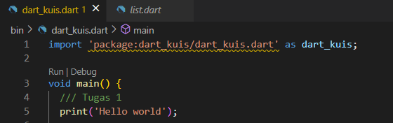

Output :

Penjelasan :

Perintah print() digunakan untuk mencetak atau menampilkan teks atau nilai ke layar.

### Soal 2
Kode Program :

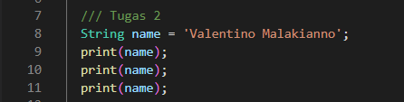

Output : 

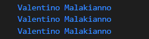

Penjelasan : 

variabel name digunakan untuk menyimpan sebuah string dengan nilai "Valentino Malakianno". Kemudian, nilai dari variabel tersebut dicetak ke layar tiga kali menggunakan perintah print().

### Soal 3
Kode Program :

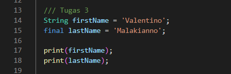

Output : 

Penjelasan : 

variabel firstName dideklarasikan dengan nilai "Valentino" dan tipe data string. Kemudian, variabel lastName dideklarasikan dengan nilai "Malakianno" dan tipe data string. Setelah itu, nilai dari variabel firstName dan lastName dicetak ke layar menggunakan perintah print(). Sehingga, outputnya akan mencetak "Valentino" dan "Malakianno".

### Soal 4
Kode Program :

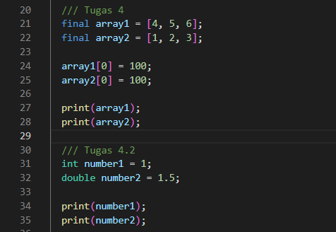

Output : 

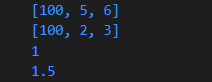

Penjelasan : 

Kodingan di atas membuat dua array dengan menggunakan kata kunci final. Array pertama disebut array1 dan berisi angka 4, 5, dan 6. Array kedua disebut array2 dan berisi angka 1, 2, dan 3.Kemudian, nilai elemen pertama dari array1 diubah menjadi 100 menggunakan sintaks array1[0] = 100. Selanjutnya, nilai elemen pertama dari array2 juga diubah menjadi 100 menggunakan sintaks array2[0] = 100.Terakhir, nilai dari array1 dan array2 dicetak ke layar menggunakan perintah print(). Sehingga, outputnya akan mencetak array array1 yang berisi [100, 5, 6] dan array array2 yang berisi [100, 2, 3].

Variabel number1 dideklarasikan dengan tipe data int dan memiliki nilai 1. Variabel number2 dideklarasikan dengan tipe data double dan memiliki nilai 1.5.Selanjutnya, nilai dari variabel number1 dan number2 dicetak ke layar menggunakan perintah print(). Sehingga, outputnya akan mencetak nilai 1 dan 1.5 secara berurutan.

### Soal 5
Kode Program :

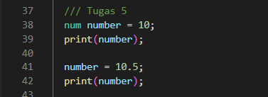

Output : 

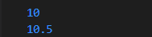

Penjelasan : 

Kodingan di atas adalah sebuah program sederhana yang menggunakan variabel untuk menyimpan nilai. Pertama, variabel number dideklarasikan dengan nilai 10 dan tipe data num. Kemudian, nilai dari variabel number dicetak ke layar menggunakan perintah print(). Sehingga, outputnya akan mencetak nilai 10.Selanjutnya, nilai dari variabel number diubah menjadi 10.5 yang merupakan tipe data double. Kemudian, nilai dari variabel number yang baru diubah dicetak ke layar menggunakan perintah print(). Sehingga, outputnya akan mencetak nilai 10.5.

### Soal 6
Kode Program :

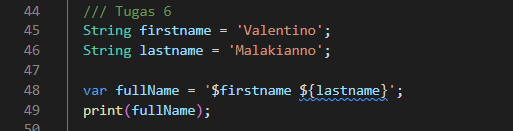

Output : 

Penjelasan : 

Pertama, variabel firstname dideklarasikan dengan nilai "Valentino" dan tipe data string. Kemudian, variabel lastname dideklarasikan dengan nilai "Malakianno" dan tipe data string.Selanjutnya, variabel fullName dideklarasikan sebagai variabel gabungan yang menggabungkan nilai dari firstname dan lastname menggunakan sintaks ${}. Variabel fullName akan menjadi "Valentino Malakianno" 

### Soal 7
Kode Program :

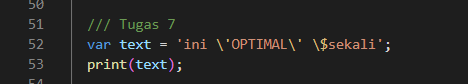

Output : 

Penjelasan : 

Kodingan di atas adalah sebuah program sederhana yang menggunakan variabel untuk menyimpan nilai string. Variabel text dideklarasikan dengan nilai "ini 'OPTIMAL' $sekali" dan tipe data string.Selanjutnya, nilai dari variabel text dicetak ke layar menggunakan perintah print(). Sehingga, outputnya akan mencetak "ini 'OPTIMAL' $sekali".

### Soal 8
Kode Program :

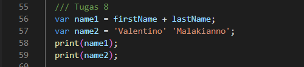

Output : 

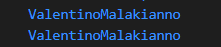

Penjelasan : 

variabel nama1 adalah gabungan dari isi data firstname dan lastname. variabel nama2 adalah gabungan dari data string "Valentino" dan "Malakianno".

### Soal 9
Kode Program :

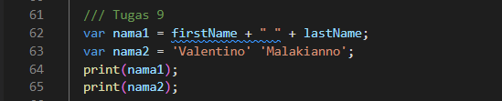

Output : 

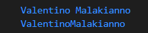

Penjelasan : 

Pada baris pertama, kita mendeklarasikan variabel nama1 dan menginisialisasinya dengan nilai dari gabungan firstname, spasi, dan lastname. Operator + digunakan untuk menggabungkan string firstname dan lastname dengan spasi di antaranya.Pada baris kedua, kita mendeklarasikan variabel nama2 dan menginisialisasinya dengan nilai gabungan dari dua string literal, yaitu 'Valentino' dan 'Malakianno'. Dalam kasus ini, kedua string literal tersebut ditempatkan berdampingan tanpa menggunakan operator apapun. Ini juga merupakan cara alternatif untuk menggabungkan string dalam beberapa bahasa pemrograman.

### Soal 10
Kode Program :

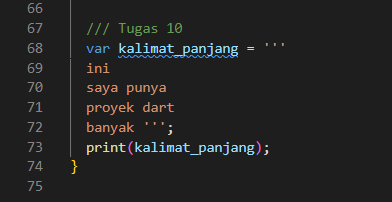

Output : 

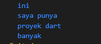

Penjelasan : 

Kode di atas adalah contoh penggunaan tanda kutip triple (''') untuk mendefinisikan sebuah string multiline dalam bahasa pemrograman Dart.